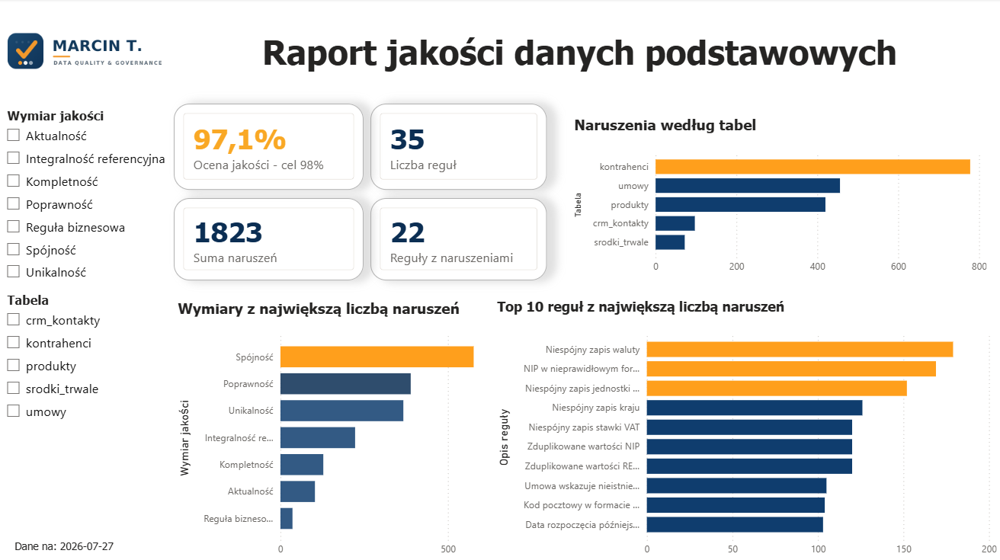
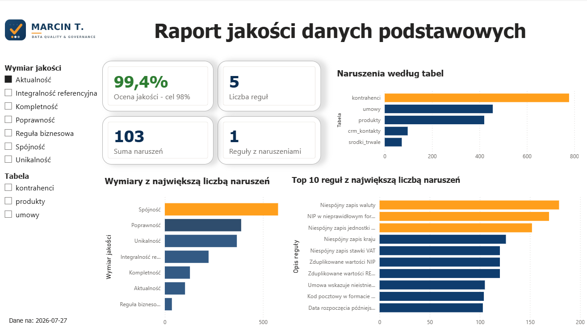
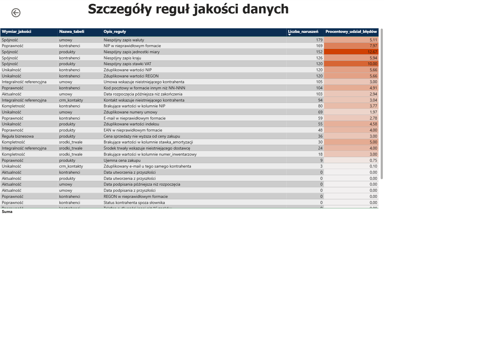

# Audyt jakości danych podstawowych w SQL-u i Power BI

Projekt przedstawia proces audytu jakości danych podstawowych – od profilowania danych i implementacji reguł jakości w SQL-u, po budowę tabeli wynikowej oraz interaktywnego dashboardu w Power BI.

## Problem

Jakość danych podstawowych ma bezpośredni wpływ na raportowanie, analizy oraz procesy biznesowe. Błędy takie jak duplikaty, brakujące wartości, niespójne słowniki czy naruszenia relacji pomiędzy tabelami prowadzą do nieprawidłowych analiz i zwiększają koszt utrzymania danych.

Celem projektu było wykrycie problemów z jakością danych, zmierzenie ich skali oraz przygotowanie raportu wspierającego działania związane z Data Quality i Master Data Management.

> **Dane w tym repozytorium są syntetyczne** (wygenerowane na potrzeby projektu).
> Nie zawierają żadnych rzeczywistych informacji o firmach ani osobach.

> ## Projekt w skrócie

- profilowanie danych z pięciu tabel
- implementacja 35 reguł jakości danych w SQL
- budowa tabeli wynikowej (`dq_wyniki`)
- dashboard KPI w Power BI
- analiza sześciu wymiarów jakości danych

  

  

  

## Dane

Pięć powiązanych tabel w formacie CSV (dane podstawowe):

| Tabela | Znaczenie | Liczba wierszy |
|---|---|---|
| `kontrahenci` | kontrahenci | 2 120 |
| `produkty` | produkty | 1 200 |
| `umowy` | umowy | 3 500 |
| `crm_kontakty` | kontakty CRM | 3 090 |
| `srodki_trwale` | środki trwałe | 600 |

## Reguły jakości

Napisałem **35 reguł w SQL**, pogrupowanych w sześć wymiarów jakości. Każda reguła
ma `Rule ID`, opis i zwraca zarówno listę błędnych rekordów, jak i procent naruszeń.

| Wymiar | Reguły | Przykłady |
|---|---|---|
| Kompletność | 3 | braki NIP, numeru inwentarzowego, stawki amortyzacji |
| Unikalność | 7 | duplikaty NIP / REGON / indeksu / numeru umowy |
| Poprawność | 12 | format NIP, kodu pocztowego, e-maila, EAN; ujemne ceny |
| Spójność | 4 | słowniki: kraj, waluta, jednostka miary, stawka VAT |
| Integralność referencyjna | 3 | rekordy osierocone (umowy, CRM, środki → kontrahenci) |
| Aktualność | 5 | daty z przyszłości, błędna kolejność dat umów |
| Reguła biznesowa | 1 | marża: cena sprzedaży ≥ cena zakupu |

## Przebieg projektu

Projekt został zrealizowany w czterech etapach:

### 1. Profilowanie danych

Na początku przeanalizowałem strukturę i jakość danych w pięciu tabelach. Sprawdziłem między innymi kompletność, duplikaty, rozkład wartości, formaty danych oraz zakresy dat. Dzięki temu możliwe było określenie, które obszary wymagają walidacji.

### 2. Implementacja reguł jakości danych

Na podstawie wyników profilowania przygotowałem 35 reguł jakości danych w SQL-u, obejmujących sześć wymiarów jakości. Każda reguła zwraca liczbę naruszeń, procent błędnych rekordów oraz listę rekordów wymagających poprawy.

### 3. Budowa scorecard

Wyniki wszystkich reguł zostały zapisane w tabeli `dq_wyniki`, która stanowi centralne źródło danych dla raportowania. Dzięki ujednoliconej strukturze możliwe jest porównywanie jakości pomiędzy tabelami, wymiarami oraz poszczególnymi regułami.

### 4. Dashboard Power BI

Na podstawie tabeli wynikowej przygotowałem interaktywny dashboard prezentujący wskaźniki jakości danych, liczbę naruszeń oraz możliwość analizy szczegółów z wykorzystaniem mechanizmu Drill Through.

## Kluczowe wyniki

- **Ogólny wskaźnik jakości ~97%** — wysoki jako średnia, ale maskuje, gdzie
  naprawdę leżą problemy.
- **Tabela `kontrahenci` to epicentrum.** Jako dane podstawowe jest „rodzicem" umów,
  CRM i środków, więc błąd tutaj promieniuje na całą organizację.
- **Najsłabszy wymiar to spójność** — niespójne słowniki kraju, waluty, jednostki
  miary i stawki VAT.
- Wykryto **304 rekordy osierocone** (naruszone relacje) oraz **240 duplikatów**
  NIP i REGON.

### Główny wniosek: korekta vs prewencja

Naruszenia podzieliłem na dwie grupy, bo wymagają różnych działań:

- **Do automatycznego czyszczenia (Power Query):** ta sama wartość zapisana na różne
  sposoby — kraj, waluta, jednostka, VAT, format kodu pocztowego, NIP z myślnikami.
- **Do prewencji u źródła (walidacja w ERP):** realne błędy, których czyszczenie nie
  wymyśli — braki NIP, duplikaty, rekordy osierocone, ujemna marża, błędna
  kolejność dat.

Ten podział zamienia listę błędów w konkretny plan działania.

## Dashboard

- **Strona przeglądu:** KPI (wskaźnik jakości, liczba reguł, liczba naruszeń),
  naruszenia wg wymiaru / tabeli / reguły oraz fragmentatory.
- **Strona szczegółów:** tabela reguł z warunkowym (czerwonym) formatowaniem,
  otwierana przez **drill-through** z wykresów.

  

## Jak uruchomić

1. Zaimportuj pliki CSV z `data/` do MS SQL Server (np. przez SSMS).
2. Uruchom pliki z `sql/`, aby zobaczyć błędne rekordy i procenty naruszeń.
3. Uruchom `CREATE_TABLE.sql`, a następnie `Dashboard_results.sql`, aby zbudować
   tabelę scorecard `dq_wyniki`.
4. Otwórz `powerbi/dashboard_jakosci.pbix` i odśwież źródło danych.

## Technologie

· MS SQL Server · Power BI · 

## Autor

Marcin Tylutki · GitHub: [ds-MarT90](https://github.com/ds-MarT90) ·
[LinkedIn](https://www.linkedin.com/in/marcin-tylutki/)
